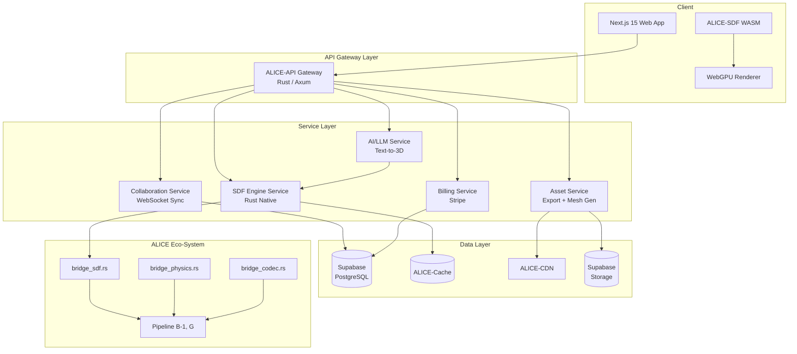
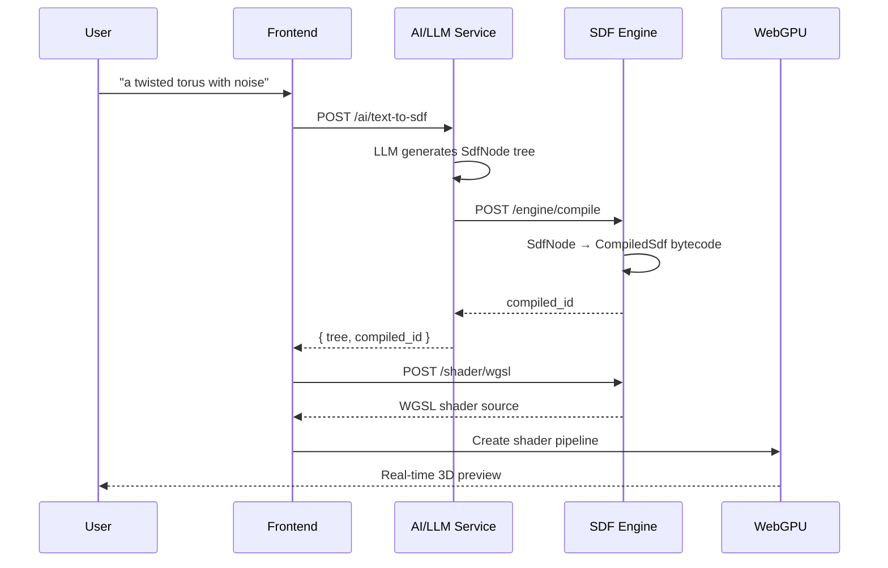
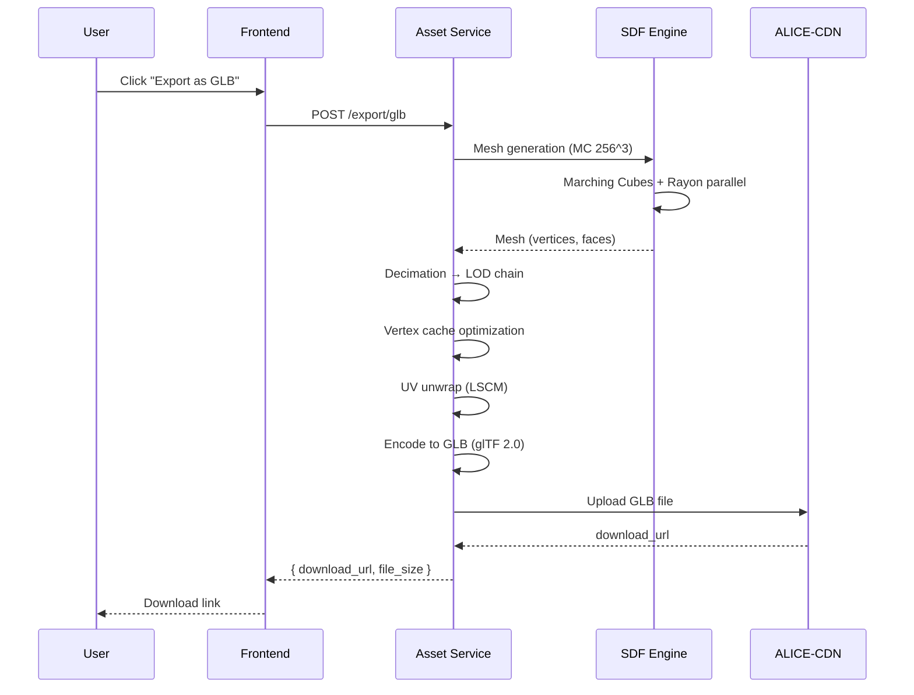

# AI Modeler SaaS — ALICE-SDF Cloud Platform

## Overview

AI Modeler SaaS is a cloud-native 3D modeling platform that exposes ALICE-SDF's industrial-strength Signed Distance Function engine through a browser-based interface. Users describe shapes in natural language or build them visually with CSG operations, and the platform compiles, evaluates, and exports production-ready 3D assets in real-time via WebGPU.

The platform combines three foundational components:
- **ALICE-SDF v1.1.0** (Rust): 126 SDF node types, 7 evaluation modes, 15 I/O formats, 1,003 tests
- **OmniCreatorTemplate** (Next.js 15): SaaS platform with 50+ agents, Supabase, Stripe billing
- **ALICE-Eco-System**: 63 bridge modules connecting 51 ALICE crates via zero-copy pipelines

## Licensing Strategy

### Dual License Model

| License | Target | Obligation | Revenue |
|---------|--------|-----------|---------|
| **AGPL-3.0** (Public) | Open-source community, researchers, startups | Anyone running this code as a SaaS **must publish their entire service source code** | Free (viral copyleft protection) |
| **Commercial License** (Proprietary) | Enterprises (Adobe, Google, NVIDIA, etc.) | No source code disclosure required; private/closed-source deployment permitted | Negotiated per-contract (direct sales) |

**Why AGPL-3.0?**
- AGPL-3.0's "network use" clause means that any entity operating AI Modeler SaaS (or a derivative) on a server must release the complete source code of their service to its users
- Large enterprises with proprietary codebases cannot accept this obligation — they **must** purchase a Commercial License to use ALICE-SDF in their products/services
- This prevents "free-riding" by cloud providers (AWS, Google Cloud, Azure) and tech giants while keeping the project fully open-source for the community

**Commercial License**:
- Sold directly by the copyright holder (Moroya Sakamoto)
- Grants right to use, modify, and deploy without AGPL-3.0 disclosure obligations
- Pricing negotiated per contract (enterprise scale)
- Includes priority support, SLA guarantees, and custom integration assistance

## Creation Info

- **Created**: 2026-02-23
- **Author**: Spec System (Automated)
- **Version**: 1.1.0
- **Status**: Draft

---

## Functional Requirements

### FR-001: SDF Node Tree Construction

- **Priority**: HIGH
- **Category**: Core Engine
- **Description**: Users can create SDF trees using the full ALICE-SDF node vocabulary:
  - 72 primitives (Sphere, Box, Cylinder, Torus, Cone, Capsule, Ellipsoid, Pyramid, Octahedron, Link, Gyroid, Schwarz-P, Diamond, Neovius, Lidinoid, Helix, BoxFrame, StarPolygon, etc.)
  - 24 CSG operations (Union, Intersection, Subtraction + smooth/chamfer/stairs/exp-smooth/columns variants + XOR, Morph, Pipe, Engrave, Groove, Tongue)
  - 7 transforms (Translate, RotateEuler, RotateQuat, Scale, ScaleNonUniform, ProjectiveTransform, LatticeDeform, SdfSkinning)
  - 23 modifiers (Twist, Bend, Repeat, RepeatFinite, Mirror, MirrorOctant, IFS, Noise, Displacement, HeightmapDisplacement, SurfaceRoughness, Sweep, Extrude, Revolution, PolarRepeat, IcosahedralSymmetry, Taper, Shell, Onion)

**Acceptance Criteria**:
- All 126 SDF node types are available in the editor
- Node tree is serializable to/from JSON (serde compatible)
- Tree validation rejects malformed structures

### FR-002: Real-Time WebGPU Preview

- **Priority**: HIGH
- **Category**: Rendering
- **Description**: WGSL shader transpilation from CompiledSdf enables 60fps real-time preview in the browser using WebGPU. Sphere-tracing raymarcher with soft shadows and ambient occlusion. PBR material preview (albedo, roughness, metallic, normal).

**Acceptance Criteria**:
- 60fps at 1080p on modern GPUs (RTX 3060+, Apple M1+)
- 30fps at 4K resolution (Pro tier)
- Shader compilation < 500ms for trees up to 200 nodes
- Interactive camera controls (orbit, pan, zoom)

### FR-003: Text-to-3D Generation

- **Priority**: HIGH
- **Category**: AI/LLM
- **Description**: Natural language input generates SDF tree via LLM integration (Anthropic Claude primary, Google Gemini fallback, OpenAI fallback). Uses ALICE-SDF `llm_schema` module for structured output. Supports iterative refinement ("make it taller", "add spiral grooves").

**Acceptance Criteria**:
- Successfully generates valid SDF trees for 90%+ of geometric descriptions
- Response time < 5s for simple prompts, < 15s for complex
- Iterative refinement preserves unmodified subtrees
- Generated trees compile and render without errors

### FR-004: Multi-Format Export

- **Priority**: HIGH
- **Category**: I/O
- **Description**: Export to all 15 ALICE-SDF I/O formats: ASDF (native binary), ASDF-JSON, OBJ, GLB (glTF 2.0), FBX, USD/USDA, Alembic (.abc), STL (ASCII + binary), PLY, 3MF, ABM (ALICE Binary Mesh with LOD chains), Nanite (UE5). Configurable mesh resolution (64^3 to 512^3). Automatic LOD chain generation.

**Acceptance Criteria**:
- All 15 formats produce valid, importable files
- Mesh generation 256^3 completes in < 3 seconds
- LOD chain (L0-L3) auto-generated for GLB/FBX/USD
- Download link expires after 24 hours

### FR-005: User Authentication & Authorization

- **Priority**: HIGH
- **Category**: Security
- **Description**: Supabase Auth with email/password and OAuth (Google, GitHub). JWT-based sessions. Role-based access (user, admin, enterprise-admin). API key management for programmatic access.

**Acceptance Criteria**:
- OAuth login completes in < 3 seconds
- JWT access tokens expire in 15 minutes with refresh token rotation
- API keys are AES-256 encrypted at rest
- Role escalation is impossible without admin credentials

### FR-006: Subscription & Billing

- **Priority**: HIGH
- **Category**: Business
- **Description**: Stripe integration with configurable tier-based billing. Pricing is **not hardcoded** — all amounts, limits, and plan features are configurable via admin dashboard or environment variables. Three plan tiers are defined by feature gates, but pricing is set by the operator at deployment time.

  - **Free**: Limited projects, basic preview, basic export formats, limited API calls
  - **Pro**: Expanded limits, full preview resolution, all export formats, higher API rate
  - **Enterprise**: Unlimited usage, SSO, custom deployment, SLA, dedicated support

  Note: Under AGPL-3.0, any operator deploying this SaaS must publish their service source code. Operators who wish to keep their deployment private must obtain a Commercial License.

**Acceptance Criteria**:
- Stripe Checkout integration works for all configured tiers
- Plan names, prices, limits, and features are configurable (not hardcoded)
- Usage-based billing tracks compute hours accurately
- Plan upgrade/downgrade takes effect per Stripe subscription lifecycle
- Trial period duration is configurable (default: 14 days)
- Admin dashboard for managing plans, prices, and feature gates

### FR-007: Project Management

- **Priority**: MEDIUM
- **Category**: Core
- **Description**: Full project lifecycle: create, rename, duplicate, archive, delete. Auto-save with SDF tree snapshots (versioning). Project sharing via public link or team access. Asset library for reusable SDF subtrees.

**Acceptance Criteria**:
- Auto-save triggers every 30 seconds or on significant tree changes
- Version history retains last 100 snapshots
- Public link provides read-only access with optional export

### FR-008: Collaborative Editing

- **Priority**: MEDIUM
- **Category**: Collaboration
- **Description**: Real-time multi-user editing using ALICE-SDF `tree_diff` / `apply_patch` modules. Cursor presence indicators. Per-user undo/redo. Conflict resolution via operational transform on SDF tree patches.

**Acceptance Criteria**:
- Sync latency < 100ms between users
- Up to 10 concurrent editors per project
- No data loss on simultaneous edits to different subtrees
- Graceful degradation on network interruption

### FR-009: REST API

- **Priority**: MEDIUM
- **Category**: API
- **Description**: Full CRUD for projects and SDF trees. Dedicated endpoints for compile, eval, mesh generation, export, and shader transpilation. Rate limiting per subscription tier.

**Acceptance Criteria**:
- API response P95 < 200ms for read operations
- OpenAPI 3.1 specification published at `/api-docs`
- SDK libraries for JavaScript/TypeScript and Python
- Comprehensive error codes with actionable messages

### FR-010: WebSocket API

- **Priority**: MEDIUM
- **Category**: API
- **Description**: Real-time channels for SDF tree sync, evaluation streaming, collaborative editing presence, and export job progress notifications.

**Acceptance Criteria**:
- WebSocket connection established in < 500ms
- Message delivery latency < 50ms (same region)
- Automatic reconnection with exponential backoff
- Channel-based subscription model

### FR-011: Agent-Assisted Modeling

- **Priority**: LOW
- **Category**: AI
- **Description**: Integration with OmniCreatorTemplate 3D agents via MessageBus. Automated mesh optimization suggestions, material recommendations, scene composition assistance.

**Acceptance Criteria**:
- Agent suggestions appear within 3 seconds
- User can accept/reject/modify agent suggestions
- Agent does not modify tree without user confirmation

### FR-012: Analytics Dashboard

- **Priority**: LOW
- **Category**: Business
- **Description**: Project usage statistics, export format distribution, API usage monitoring, compute resource consumption tracking.

**Acceptance Criteria**:
- Dashboard loads in < 2 seconds
- Data refreshes every 5 minutes
- Exportable CSV reports

### FR-013: Template Gallery

- **Priority**: LOW
- **Category**: Content
- **Description**: Pre-built SDF templates (architectural, mechanical, organic, abstract). Community sharing. Featured/trending templates.

**Acceptance Criteria**:
- At least 50 templates at launch
- Search and filter by category/tags
- One-click "Use Template" creates new project

### FR-014: Terrain & Destruction

- **Priority**: LOW
- **Category**: Advanced
- **Description**: Heightmap terrain with erosion simulation, clipmap LOD, Voronoi fracture for destructible objects, procedural cave generation via ALICE-SDF terrain module.

**Acceptance Criteria**:
- Terrain generation 1024x1024 in < 10 seconds
- Erosion simulation produces realistic results
- Fracture generates watertight pieces

### FR-015: Advanced Analysis

- **Priority**: LOW
- **Category**: Advanced
- **Description**: Volume & surface area estimation (Monte Carlo), automatic differentiation (gradients, Hessian, mean curvature), constraint solver for parametric relationships, SDF-to-SDF collision detection.

**Acceptance Criteria**:
- Volume estimation within 1% accuracy (1M samples)
- Gradient computation matches finite-difference within 0.1%
- Constraint solver converges in < 100 iterations

---

## Non-Functional Requirements

### Performance

- SDF evaluation: < 16ms for 256^3 grid (SIMD 8-wide + Rayon parallel)
- WebGPU preview: 60fps at 1080p, 30fps at 4K
- Mesh generation: Marching Cubes 256^3 in < 3 seconds
- API response: P95 < 200ms, P99 < 500ms
- Cold start: < 5 seconds from login to interactive editor

### Scalability

- Support 10,000+ concurrent users
- Horizontal pod autoscaling (CPU-bound SDF engine pods)
- CDN-delivered static assets via ALICE-CDN
- Supabase connection pooling (PgBouncer)

### Security

- TLS 1.3 for all connections
- JWT with 15-minute access tokens + refresh token rotation
- API key encryption at rest (AES-256)
- OWASP Top 10 compliance
- SOC 2 Type II readiness (Enterprise tier)
- GDPR compliance for EU users

### Reliability

- Uptime SLA: 99.9% (Enterprise: 99.95%)
- Automated failover with health checks
- Daily database snapshots, 30-day retention
- Disaster recovery: RPO < 1 hour, RTO < 4 hours

### Observability

- ALICE-Semantic-Telemetry integration
- Structured JSON logging
- Distributed tracing (OpenTelemetry)
- Real-time alerting via PagerDuty/Opsgenie

---

## Tech Stack

### Frontend
- **Framework**: Next.js 15 (App Router, React 19, TypeScript)
- **3D Rendering**: WebGPU + WGSL shaders (transpiled from ALICE-SDF)
- **Client SDF**: ALICE-SDF compiled to WASM (lightweight operations)
- **UI Components**: Radix UI + Tailwind CSS
- **State**: Zustand (local) + Supabase Realtime (sync)

### Backend
- **SDF Engine**: ALICE-SDF v1.1.0 native Rust binary (Axum HTTP server)
- **API Gateway**: ALICE-API (Rust) — routing, auth, rate limiting
- **Collaboration**: WebSocket service (Socket.io / Axum WS)
- **AI/LLM**: Anthropic Claude (primary), Google Gemini, OpenAI (fallback)

### Data & Storage
- **Database**: Supabase (PostgreSQL 15)
- **Cache**: ALICE-Cache (distributed evaluation cache)
- **CDN**: ALICE-CDN + Cloudflare (static assets, exported meshes)
- **Object Storage**: Supabase Storage (user assets)

### Infrastructure
- **Container**: Docker
- **Orchestration**: Kubernetes (AWS EKS / GCP GKE / Azure AKS / self-hosted)
- **Cloud Providers**: AWS, Google Cloud, Azure, or any Kubernetes-compatible platform
- **CI/CD**: GitHub Actions
- **Monitoring**: ALICE-Semantic-Telemetry + Grafana
- **DNS**: ALICE-DNS + Cloudflare (or provider-native DNS)

---

## Architecture

### System Architecture Diagram

### Data Flow: Text-to-3D Pipeline

### Data Flow: Export Pipeline

---

## Data Model

### Core Entities

| Entity | Description | Key Fields |
|--------|-------------|------------|
| `users` | User accounts (Supabase Auth) | id, email, display_name, avatar_url, plan_tier |
| `projects` | SDF modeling projects | id, user_id, name, description, sdf_tree (JSONB), compiled_bytecode, created_at, updated_at |
| `project_versions` | SDF tree snapshots | id, project_id, version_number, sdf_tree (JSONB), created_at |
| `assets` | Exported mesh files | id, project_id, format, file_path, file_size, resolution, created_at, expires_at |
| `templates` | Shared SDF templates | id, author_id, name, description, sdf_tree (JSONB), category, tags, is_featured, use_count |
| `api_keys` | API key management | id, user_id, key_hash, name, permissions, rate_limit, created_at, last_used_at |
| `subscriptions` | Stripe subscription state | id, user_id, stripe_customer_id, stripe_subscription_id, plan_tier, status, current_period_end |
| `usage_logs` | API and compute tracking | id, user_id, endpoint, method, response_time_ms, compute_ms, created_at |
| `collab_sessions` | Active collaboration sessions | id, project_id, user_ids (array), created_at, last_activity_at |

### Relationships
- User 1:N Projects
- Project 1:N ProjectVersions
- Project 1:N Assets
- User 1:N ApiKeys
- User 1:1 Subscription
- User 1:N UsageLogs
- Project 1:N CollabSessions

See `API_SPECIFICATION.md` for detailed endpoint documentation.

---

## API Specification

### Endpoint Groups

| Group | Base Path | Endpoints | Auth Required |
|-------|-----------|-----------|---------------|
| Auth | `/auth` | login, register, refresh, logout, me | Partial |
| Projects | `/projects` | CRUD + versions, duplicate, share | Yes |
| SDF Tree | `/projects/{id}/tree` | get, replace, patch, validate | Yes |
| Engine | `/engine` | compile, eval, eval/grid, normal, raycast | Yes |
| Mesh | `/mesh` | generate, get, decimate, lod, optimize, uv | Yes |
| Export | `/export/{format}` | 15 format-specific endpoints | Yes |
| Shader | `/shader/{target}` | wgsl, glsl, hlsl transpilation | Yes |
| AI | `/ai` | text-to-sdf, refine | Yes |
| Templates | `/templates` | list, get, create, featured, search | Partial |
| Analytics | `/analytics` | usage, exports, api | Yes |
| Admin | `/admin` | users, usage, config | Admin only |

### WebSocket Channels
- `editor:{project_id}` — Real-time SDF tree sync
- `preview:{project_id}` — Preview frame streaming
- `collab:{project_id}` — Collaboration presence

See `API_SPECIFICATION.md` for complete endpoint documentation with request/response schemas.

---

## Acceptance Criteria

### System-Wide
- All 15 functional requirements implemented and passing
- All 5 non-functional requirements met
- Test coverage > 80% (frontend + backend)
- Security review passed (OWASP Top 10)
- Documentation complete (API docs, user guide)
- Performance benchmarks met (see NFR-001)

### Per-Requirement
- FR-001: All 126 SDF node types available and functional
- FR-002: 60fps preview at 1080p confirmed on reference hardware
- FR-003: 90%+ success rate on 100 test prompts
- FR-004: All 15 export formats produce valid files
- FR-005: OAuth + email auth working, API keys functional
- FR-006: Stripe checkout, upgrade, downgrade all working
- FR-007: Auto-save, versioning, sharing operational
- FR-008: 2+ users editing simultaneously without data loss

---

## Implementation Plan

### Phase 1: Core Platform (Weeks 1-4)
- SDF engine Rust server (Axum) with compile/eval/mesh endpoints
- WASM compilation for client-side lightweight evaluation
- WGSL shader transpilation and WebGPU renderer
- Basic CSG editor UI (node tree panel + 3D viewport)
- Supabase Auth integration
- Project CRUD (create, save, load, delete)
- OBJ/STL export (basic formats)

### Phase 2: Full Feature Set (Weeks 5-8)
- Text-to-3D via LLM integration (Claude + Gemini + OpenAI)
- All 15 export formats enabled
- Stripe billing integration (3 tiers)
- REST API with rate limiting
- WebSocket API for real-time sync
- Template gallery (50+ starter templates)
- Analytics dashboard

### Phase 3: Enterprise & Scale (Weeks 9-12)
- Collaborative editing (tree diff/patch sync)
- Agent-assisted modeling (OmniCreatorTemplate agents)
- Enterprise features (SSO, custom deployment, SLA)
- ALICE-Eco-System integration (CDN, Cache, Analytics bridges)
- Terrain & destruction modules
- Advanced analysis tools (volume, curvature, constraints)
- Performance optimization and load testing

---

## Risks & Mitigations

### Technical Risks

| Risk | Impact | Probability | Mitigation |
|------|--------|-------------|------------|
| WebGPU browser support gaps | HIGH | MEDIUM | Fallback to WebGL 2.0 raymarcher; progressive enhancement |
| WASM binary size too large | MEDIUM | LOW | Tree-shaking unused SDF nodes; lazy-load advanced primitives |
| LLM generates invalid SDF trees | MEDIUM | HIGH | Server-side validation + auto-repair; constrained output schema |
| Real-time collab conflict resolution | HIGH | MEDIUM | Operational transform on tree patches; lock-based fallback |
| SDF engine pod autoscaling latency | MEDIUM | LOW | Warm pool of pre-started engine pods; request queuing |

### Business Risks

| Risk | Impact | Probability | Mitigation |
|------|--------|-------------|------------|
| Low conversion Free → Pro | HIGH | MEDIUM | Feature-gated preview quality; generous free trial |
| Compute costs exceed revenue | HIGH | LOW | Usage-based billing for heavy operations; spot instances |
| Competition from existing 3D SaaS | MEDIUM | HIGH | Differentiate on SDF-native workflow + text-to-3D |

### Schedule Risks

| Risk | Impact | Probability | Mitigation |
|------|--------|-------------|------------|
| WebGPU renderer complexity | HIGH | MEDIUM | Start with basic sphere-tracing; iterate on quality |
| Multi-format export edge cases | MEDIUM | HIGH | Prioritize top 5 formats (OBJ, GLB, STL, FBX, USD); defer others |
| LLM prompt engineering iteration | MEDIUM | MEDIUM | Use ALICE-SDF llm_schema module; pre-built prompt templates |

---

## Notes

- ALICE-SDF v1.1.0 is production-stable with 1,003 passing tests, 0 clippy warnings, 0 doc warnings
- OmniCreatorTemplate provides battle-tested SaaS infrastructure (Supabase, Stripe, agent system)
- ALICE-Eco-System bridge_sdf.rs provides ready-made Analytics/DB/Edge/Cache bridges
- **License: AGPL-3.0 (public) + Commercial License (proprietary, direct sales)**
- AGPL-3.0 prevents cloud providers and enterprises from deploying closed-source forks without purchasing a commercial license
- All pricing is operator-configurable — no hardcoded dollar amounts in the codebase
- Deployable on AWS, Google Cloud, Azure, or any Kubernetes-compatible infrastructure
- Supabase can be used as managed service or self-hosted
- WebGPU is supported in Chrome 113+, Firefox 121+, Safari 18+ (covers 85%+ of target users)

---

*This document was generated following the OmniCreatorTemplate Spec System format.*
